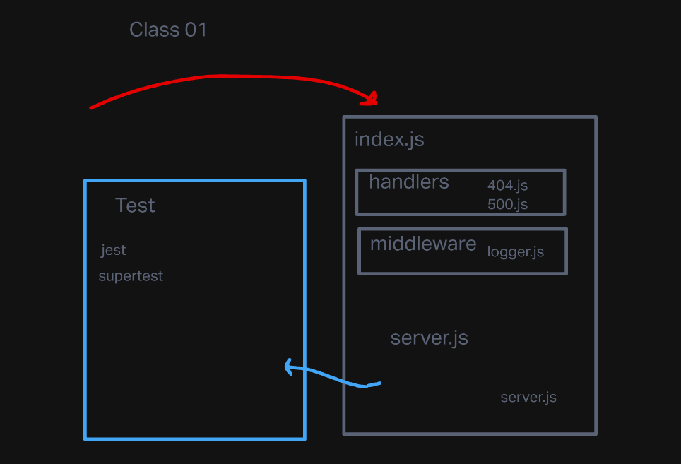

# server-deployment-practice

## Project: Server-Deployment-Practice

## Author: Zoe Gonzalez

### Problem Domain: This application exists for th purpose of practicing deployment of server more in depth than I did in 301.

GitHub Actions: https://github.com/ZuSolaris/server-deployment-practice/actions

Production Deployment: https://dashboard.render.com/web/srv-ce2ldb6n6mpmkc6p9pj0

Development Deployment: https://server-deploy-dev-siby.onrender.com/

### Setup

#### env requirements

see `.env.sample`

PORT: 3001 

### How to initalize application

'npm start'

'nodemon'

'npm test'

#### How to use your library

-nodemon

#### Features / Routes

/ : automatically redirects you to the page.

/bad: Sends you to an error page.

/* : If the page is not available then an error flag is thrown. 

